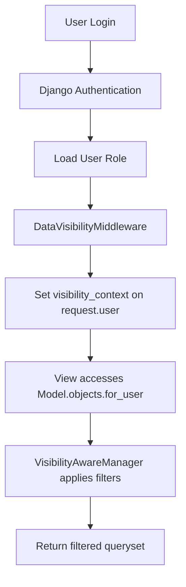

# SalesCompass CRM - Data Visibility & Security Guide

## Overview
SalesCompass CRM implements a sophisticated data visibility system that controls which records users can access based on their role, team structure, and territory assignments. This guide explains how to configure and manage data visibility rules.

## Data Visibility Rules

### Visibility Levels
The system supports four visibility levels:

#### 1. Own Only (`own_only`)
Users can only see records they own.

**Use Case**: Sales reps who should only manage their own leads and accounts.

**Example**:
- Sales Rep A owns 10 leads
- Sales Rep A can only see their 10 leads
- Sales Rep A cannot see leads owned by other reps

#### 2. Team Only (`team_only`)
Users can see their own records plus records owned by their direct reports.

**Use Case**: Sales managers who need visibility into their team's pipeline.

**Example**:
- Manager has 3 direct reports
- Manager can see their own records
- Manager can see all records owned by their 3 reports
- Manager cannot see records from other teams

#### 3. Territory Only (`territory_only`)
Users can see records owned by anyone in the same territory.

**Use Case**: Regional sales teams working collaboratively.

**Example**:
- User is assigned to "North America" territory
- User can see all records owned by users in "North America"
- User cannot see records from "EMEA" or other territories

#### 4. All (`all`)
Users can see all records across the organization.

**Use Case**: Admins, executives, or operations teams needing full visibility.

**Example**:
- VP of Sales with 'all' visibility
- Can see all leads, accounts, opportunities, and cases
- No filtering applied

## Configuring Visibility Rules

### Step 1: Create or Edit a Role

1. Navigate to **Settings** → **Roles**
2. Click **Add Role** or select an existing role
3. Locate the **Data Visibility Rules** section

### Step 2: Define Visibility per Module

Data visibility rules are defined per module (model). You can set different rules for different modules:

```json
{
  "lead": "own_only",
  "account": "team_only",
  "opportunity": "team_only",
  "case": "own_only"
}
```

This configuration means:
- User sees only their own leads
- User sees team accounts and opportunities
- User sees only their own cases

### Step 3: Assign Role to Users

1. Navigate to **Settings** → **Users**
2. Select a user
3. Assign the appropriate role
4. Save changes

## Team Structure Setup

For `team_only` visibility to work correctly, you must configure the team hierarchy:

### Creating Team Members

1. Navigate to **Settings** → **Team Members**
2. Click **Add Team Member**
3. Select the user
4. Assign a **Manager** (if applicable)
5. Save

### Example Team Hierarchy

```
VP of Sales (team_only for accounts)
├── Regional Manager West (team_only for leads)
│   ├── Sales Rep 1 (own_only)
│   └── Sales Rep 2 (own_only)
└── Regional Manager East (team_only for leads)
    ├── Sales Rep 3 (own_only)
    └── Sales Rep 4 (own_only)
```

## Territory Setup

For `territory_only` visibility:

### Creating Territories

1. Navigate to **Settings** → **Territories**
2. Click **Add Territory**
3. Enter territory name (e.g., "North America")
4. Define country codes: `["US", "CA", "MX"]`
5. Save

### Assigning Users to Territories

1. Navigate to **Settings** → **Team Members**
2. Select a team member
3. Assign a **Territory**
4. Save

## Security Model

### Authentication & Authorization Flow



### Middleware Stack

The system uses two middleware components:

1. **ThreadLocalUserMiddleware**: Stores the current user in thread-local storage for model-level access.
2. **DataVisibilityMiddleware**: Injects `visibility_context` into `request.user` based on their role's `data_visibility_rules`.

### Manager-Level Filtering

The `VisibilityAwareManager` is applied to core models (Lead, Account, Opportunity, Case). Instead of using `Model.objects.all()`, use:

```python
Lead.objects.for_user(request.user)
```

This applies appropriate filters based on the user's visibility rules.

### Superuser Bypass

Superusers always bypass visibility filters and can see all records. This is by design to allow system administration.

## Best Practices

### 1. Principle of Least Privilege
Start with `own_only` and grant broader access only when necessary.

### 2. Consistent Role Design
Keep visibility rules consistent within a role. For example, if a role has `team_only` for leads, it should likely have `team_only` for opportunities as well.

### 3. Regular Audits
Periodically review user roles and visibility rules to ensure they align with current business needs.

### 4. Document Custom Rules
If you create custom visibility configurations, document the business rationale and expected behavior.

### 5. Test Before Production
Always test visibility changes in a staging environment with sample data before applying to production.

## Troubleshooting

### Users Cannot See Expected Records

**Check**:
1. User's assigned role and its `data_visibility_rules`
2. Team hierarchy (for `team_only`)
3. Territory assignment (for `territory_only`)
4. Record ownership

### Manager Cannot See Team Records

**Common Causes**:
- Team hierarchy not configured (no direct reports assigned)
- Role has `own_only` instead of `team_only`
- Reports are assigned to a different manager

### Cross-Tenant Data Leakage

The current implementation focuses on role-based visibility. For multi-tenant deployments, ensure:
- All records have correct `tenant_id`
- Views filter by `request.user.tenant_id` in addition to visibility rules
- Middleware validates tenant membership

## Technical Reference

### Role Model Fields

- `name`: Role name (e.g., "Sales Manager")
- `permissions`: List of permission strings (e.g., `["leads:write", "accounts:read"]`)
- `data_visibility_rules`: JSON dict mapping model names to visibility levels

### User Model Attributes (Set by Middleware)

- `user.visibility_context`: Dict of visibility rules for the current request

### Manager Methods

- `Model.objects.for_user(user)`: Returns filtered queryset based on visibility rules

## Support

For additional assistance with data visibility configuration, contact your system administrator or refer to the technical documentation.
